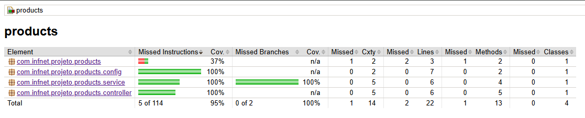

# 📦 Projeto Products – Sistema CRUD com Testes Automatizados

Este projeto consiste em um **sistema CRUD completo de Produtos**, desenvolvido com **Spring Boot no backend**, **React no frontend** e uma **estratégia robusta de testes automatizados**, contemplando testes unitários, testes de controller e testes end-to-end (E2E) com Selenium.

O objetivo principal é demonstrar a aplicação de **boas práticas de desenvolvimento**, **Clean Code**, **tratamento de erros**, **organização em camadas** e **técnicas de testes de software**, garantindo confiabilidade e qualidade do sistema.

---
## 🚀 Como Rodar a Aplicação
Para executar o projeto Products – Sistema CRUD, é necessário que o ambiente esteja corretamente configurado.

### 📋 Pré-requisitos
Certifique-se de ter os seguintes softwares instalados:

- Docker Desktop
- Java 17+
- Node.js 18+ (recomendado)
- npm ou yarn

### 🐳 Banco de Dados (Docker)
O banco de dados da aplicação é executado via Docker Compose. O projeto possui uma dependencia de suporte para docker compose, então quando a aplicação for rodada, todo o processo de instalação da imagem e também subida do
container está automatizada.

### 📌 Observações:
O projeto também possui o Flyway, que ao startar a aplicação, criará todas as tabelas e também irá inserir todos os dados necessários para testar a aplicação.

### ☕ Rodando o Backend (Spring Boot)
- Basta clicar no icone de **Run** do IntelliJ ou rodar o comando ```mvn spring-boot:run```
- O backend estará disponível em: ```http://localhost:8080```

### ⚛ Rodando o Frontend
- basta acessar a pasta do frontend em ```cd frontend```
- rodar um ```npm install``` para instalar todas as dependencias do projeto
- finalmente ```npm run dev``` para iniciar a aplicação que estará disponível em ```http://localhost:5173```

## 📑 Sumário

### 🔹 Visão Geral
- [1. Arquitetura do Projeto](#1--arquitetura-do-projeto)
- [2. Tecnologias Utilizadas](#2--tecnologias-utilizadas)

### 🔹 Backend (Spring Boot)
- [3. Camada de Domínio](#3--camada-de-domínio)
- [4. Camada de Serviço](#4--camada-de-serviço)
- [5. Camada de Controller (API REST)](#5--camada-de-controller-api-rest)
- [6. Configuração de CORS](#6--configuração-de-cors)

### 🔹 Frontend (React)
- [7. Interface do Usuário](#7--interface-do-usuário)
- [8. Integração Frontend x Backend](#8--integração-frontend-x-backend)

### 🔹 Testes Automatizados
- [9. Estratégia de Testes](#9--estratégia-de-testes)
- [10. Testes Unitários – Service](#10--testes-unitários--service)
- [11. Testes de Controller – API REST](#11--testes-de-controller--api-rest)
- [12. Testes End-to-End (E2E) com Selenium](#12--testes-end-to-end-e2e-com-selenium)
- [13. Page Object Pattern](#13--page-object-pattern)

### 🔹 Qualidade
- [14. Tratamento de Erros e Robustez](#14--tratamento-de-erros-e-robustez)
- [15. Boas Práticas e Clean Code](#15--boas-práticas-e-clean-code)
- [16. Cobertura de Testes](#16--cobertura-de-testes)

---

## 1️⃣ Arquitetura do Projeto

O projeto segue uma arquitetura **em camadas**, separando claramente responsabilidades:

```
Backend (Spring Boot)
├── controller
├── service
├── repository
├── domain
└── config

Tests
├── Unitários
├── Controller
└── E2E (Selenium)
```

```
Frontend (React)
├── domain
    └── products.ts
└── App.tsx
└── main.tsx
```

Essa separação facilita:
- Manutenção
- Testabilidade
- Evolução do sistema

---

## 2️⃣ Tecnologias Utilizadas

### Backend
- Java 17
- Spring Boot
- Spring MVC
- Spring Data JPA
- Mockito
- JUnit 5
- MockMvc
- Flyway

### Frontend
- React + TypeScript
- Axios
- PrimeReact

### Testes E2E
- Selenium WebDriver
- WebDriverManager
- Chrome Headless

---

## 3️⃣ Camada de Domínio

A entidade `Product` representa o núcleo do sistema, contendo atributos como:

- nome
- categoria
- valor

Ela é utilizada em todas as camadas, garantindo consistência do modelo de dados.

---

## 4️⃣ Camada de Serviço

A classe `ProductService` concentra as **regras de negócio**, garantindo que estados inválidos não sejam persistidos.

### Exemplo de validação:
- Produtos com valor **zero ou negativo** não são permitidos
- Uma `IllegalArgumentException` é lançada para evitar inconsistência

Essa abordagem aumenta a **robustez do sistema**.

---

## 5️⃣ Camada de Controller (API REST)

A classe `ProductController` expõe os endpoints REST:

| Método | Endpoint | Descrição |
|-----|--------|----------|
GET | `/api/products` | Lista produtos |
POST | `/api/products` | Cria produto |
PUT | `/api/products/{id}` | Atualiza produto |
DELETE | `/api/products/{id}` | Remove produto |

O controller atua apenas como intermediário HTTP, delegando regras ao service.

---

## 6️⃣ Configuração de CORS

A classe `WebConfig` permite a comunicação segura entre:

- Frontend: `http://localhost:5173`
- Backend: `http://localhost:8080`

Isso garante que o frontend possa consumir a API sem bloqueios de CORS.

---

## 7️⃣ Interface do Usuário

A interface foi construída com **React + PrimeReact**, oferecendo:

- Listagem em tabela
- Modal para criação/edição
- Toasts de sucesso e erro
- Diálogo de confirmação de exclusão

---

## 8️⃣ Integração Frontend x Backend

A comunicação é feita via **Axios**, consumindo a API REST.

Exemplos:
- `GET /api/products`
- `POST /api/products`
- `PUT /api/products/{id}`
- `DELETE /api/products/{id}`

Mensagens de erro e sucesso são tratadas no frontend com feedback visual ao usuário.

---

## 9️⃣ Estratégia de Testes

O projeto adota uma **pirâmide de testes**:

- 🔹 Testes Unitários (Service)
- 🔹 Testes de Controller (MockMvc)
- 🔹 Testes End-to-End (Selenium)

Essa abordagem garante:
- Rápida detecção de erros
- Alta confiabilidade
- Cobertura ampla de cenários

---

## 🔟 Testes Unitários – Service

A classe `ProductServiceTest` utiliza **JUnit 5 + Mockito**.

### Cenários testados:
- Cadastro com valor válido (sucesso)
- Cadastro com valor zero (falha)
- Cadastro com valor negativo (falha)
- Listagem de produtos
- Exclusão por ID

São aplicadas técnicas de:
- **Partições equivalentes**
- **Análise de limites**
- **Testes de exceção**

---

## 1️⃣1️⃣ Testes de Controller – API REST

A classe `ProductControllerTest` utiliza **MockMvc**, validando:

- Retorno HTTP 200
- Estrutura JSON
- Integração correta com o service (mockado)

Esses testes garantem que a API esteja corretamente exposta e funcional.

---

## 1️⃣2️⃣ Testes End-to-End (E2E) com Selenium

Os testes E2E simulam o comportamento real do usuário no navegador.

### Casos positivos:
- Cadastrar produto
- Editar produto
- Excluir produto

### Casos negativos:
- Salvar produto com campos vazios
- Salvar sem nome
- Salvar sem valor
- Editar produto inválido

Os testes verificam **mensagens visuais (toast)** exibidas ao usuário.

---

## 1️⃣3️⃣ Page Object Pattern

A classe `ProductPage` implementa o **Page Object Pattern**, centralizando:

- Localizadores (By)
- Ações da interface
- Interações com elementos

Isso reduz duplicação de código e facilita manutenção dos testes.

---

## 1️⃣4️⃣ Tratamento de Erros e Robustez

O sistema trata erros em múltiplas camadas:

- Backend: exceções de validação
- Frontend: captura de erros HTTP
- UI: mensagens claras ao usuário

Isso garante que estados inválidos não comprometam o sistema.

---

## 1️⃣5️⃣ Boas Práticas e Clean Code

O projeto aplica princípios de Clean Code:
- Métodos curtos e legíveis
- Responsabilidade única
- Separação clara de camadas
- Nomes autoexplicativos

---

## 1️⃣6️⃣ Cobertura de Testes

Com a combinação de testes:
- Unitários
- Controller
- E2E

O projeto atinge **cobertura superior a 80%**, atendendo plenamente aos critérios de qualidade e confiabilidade exigidos.



---

## ✅ Conclusão

Este projeto demonstra de forma prática e completa:
- Implementação de um CRUD robusto
- Aplicação de técnicas de testes de software
- Uso de boas práticas de desenvolvimento
- Organização e manutenibilidade do código

Atendendo integralmente aos requisitos acadêmicos e profissionais.
